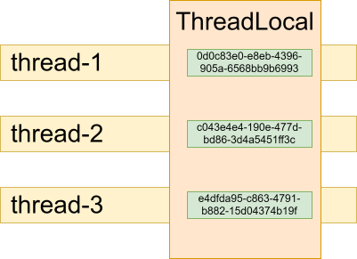
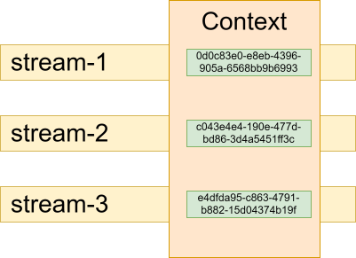

class: inverse, center, middle

# ThreadLocal használata

.card[
* .card-img[]
* Viczián István
* JTechLog
]

---

## ThreadLocal

.center-image[

]

---

class: inverse, center, middle

# Context használata Project Reactorban

.card[
* .card-img[]
* Viczián István
* JTechLog
]

---

## Context

.center-image[

]

---

class: inverse, center, middle

# Java 25 ScopedValue

.card[
* .card-img[]
* Viczián István
* JTechLog
]

---

## ScopedValue

* Java 25
* Structured concurrency
* Virtual thread
* Módosíthatatlan
* Auto cleanup